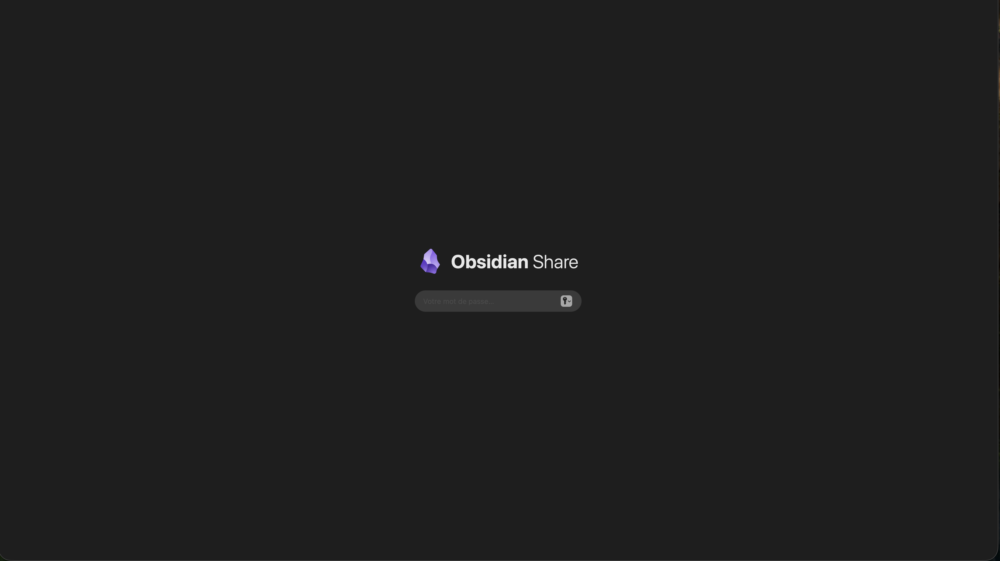
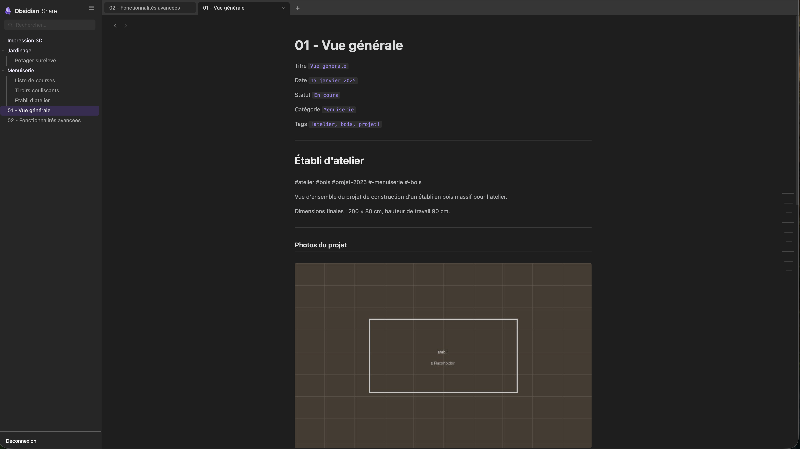
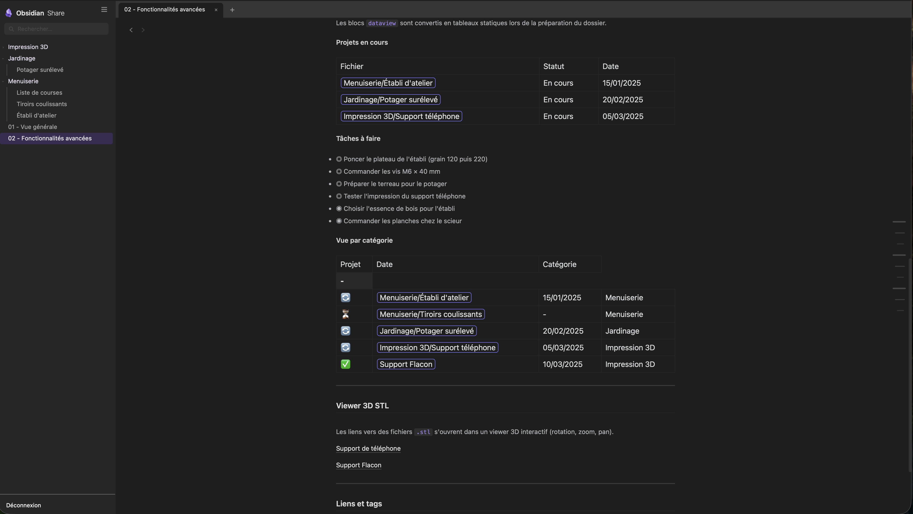
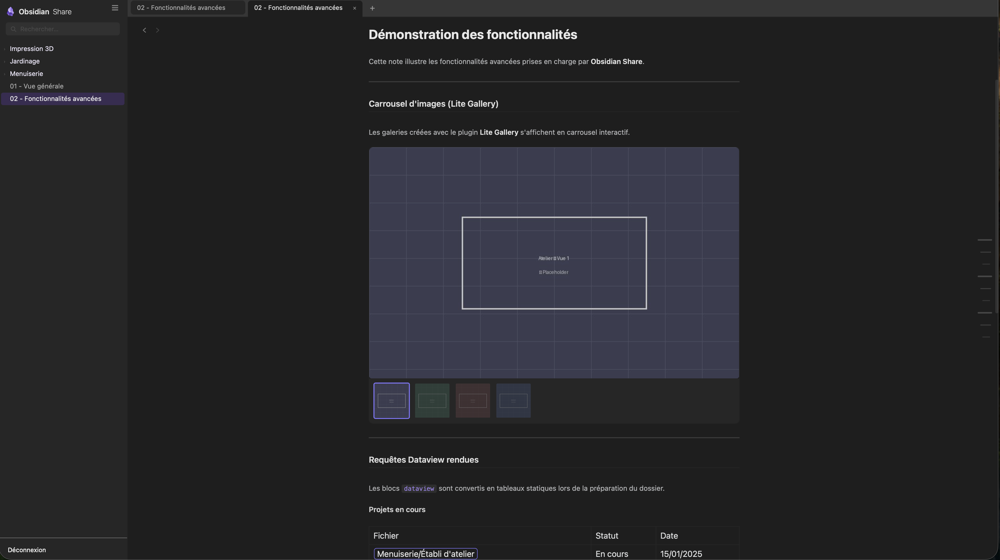

# Obsidian Share

Transformez votre vault Obsidian (ou un dossier) en site web privé, accessible depuis n'importe où avec un mot de passe.

Un script Python prépare et uploade vos notes sur votre serveur. Un frontend PHP les affiche avec une interface inspirée d'Obsidian : dark mode, onglets, recherche, et support de plusieurs fonctionnalités avancées.

---

## Aperçu







---

## Comment ça fonctionne

```
Vault Obsidian (local)
        ↓  scripts/prepare_folder.py
   Dossier web (notes converties, images extraites, Dataview rendu)
        ↓  FTP automatique
   Serveur PHP
        ↓
   Site web protégé par mot de passe
```

1. Tu glisses un dossier Obsidian dans le Terminal
2. Le script convertit les notes, extrait les images, traite les blocs Dataview, et génère un mot de passe
3. Tout est uploadé automatiquement via FTP
4. Tu accèdes à ton site, tu entres le mot de passe → tes notes s'affichent

---

## Fonctionnalités

### Affichage Markdown
| Élément | Support |
|---------|---------|
| Titres H1–H6, gras, italique | ✅ |
| Listes, tableaux, code | ✅ |
| Images `![[image]]` avec redimensionnement | ✅ |
| Liens Obsidian `[[note]]` | ✅ affichés en badges |
| Tags `#hashtag` | ✅ affichés en badges |

### Plugins Obsidian supportés
Ces fonctionnalités sont détectées et rendues automatiquement **si tu les utilises** dans ton vault. Aucun plugin n'est obligatoire pour que le projet fonctionne.

| Plugin | Fonctionnalité rendue |
|--------|-----------------------|
| [Dataview](https://github.com/blacksmithgu/obsidian-dataview) | Tables, listes de tâches, requêtes (`TABLE`, `TASK`, `LIST`, `WHERE`, `SORT`, `GROUP BY`…) |
| [Lite Gallery](https://github.com/jpoles1/obsidian-litegal) | Carrousel d'images interactif (blocs ` ```litegal `) |

### Viewer 3D STL
Les liens vers des fichiers `.stl` locaux (ex: pièces imprimées en 3D) sont détectés, copiés, et affichés dans un viewer 3D interactif (WebGL / Three.js) directement dans un onglet du site.




> ⚠️ Les fichiers STL nécessitent un lien `file://` valide sur ta machine au moment du traitement — le script les copie ensuite automatiquement.

### Interface
- Système d'onglets (navigation multi-fichiers)
- Sidebar avec arborescence complète
- Barre de recherche (nom de fichier + contenu)
- Table des matières automatique (H1/H2/H3)
- URLs propres via `.htaccess`
- Dark mode (palette violet/lavande, inspiré Obsidian)

### Sécurité
- Mots de passe 15 caractères générés aléatoirement (cryptographiquement sûrs)
- Hashés en Bcrypt côté serveur
- Protection brute force (blocage IP après 500 tentatives / 24h)
- HTTPS forcé, headers sécurité HTTP
- `config.json` inaccessible depuis le web

---

## Prérequis

**En local (Mac) :**
- Python 3
- Bibliothèques : `bcrypt`, `pyyaml` (`pip3 install bcrypt pyyaml`)

**Serveur :**
- Hébergement avec accès FTP et support PHP
- *(Testé sur Hostinger — tout hébergeur mutualisé avec PHP devrait fonctionner)*

---

## Installation

→ Voir **[docs/INSTALLATION_NOUVELLE_MACHINE.md](docs/INSTALLATION_NOUVELLE_MACHINE.md)** pour le guide complet.

Le guide couvre :
- L'installation des dépendances Python
- La configuration FTP (`scripts/config.py`)
- La création d'une application lanceur Automator (Mac)
- L'utilisation au quotidien

---

## Stack technique

| Couche | Technologie |
|--------|-------------|
| Préparation locale | Python 3 |
| Backend / rendu | PHP |
| Viewer 3D | Three.js (WebGL) |
| Frontend | HTML/CSS/JS vanilla |
| Authentification | Bcrypt (PHP) |
| Upload | FTP |

---

## Contribuer

Ce projet est open-source sous licence **MIT**.

L'objectif initial était de supporter les fonctionnalités d'un vault personnel. Il est conçu pour être étendu — si tu utilises un plugin Obsidian non encore supporté, tu peux ajouter son rendu dans `server/view.php` et contribuer via une Pull Request.

Les modules Python (`scripts/dataview/`, `scripts/stl/`) sont volontairement isolés et réutilisables pour faciliter les contributions.

---

## Licence

[MIT](LICENSE)
